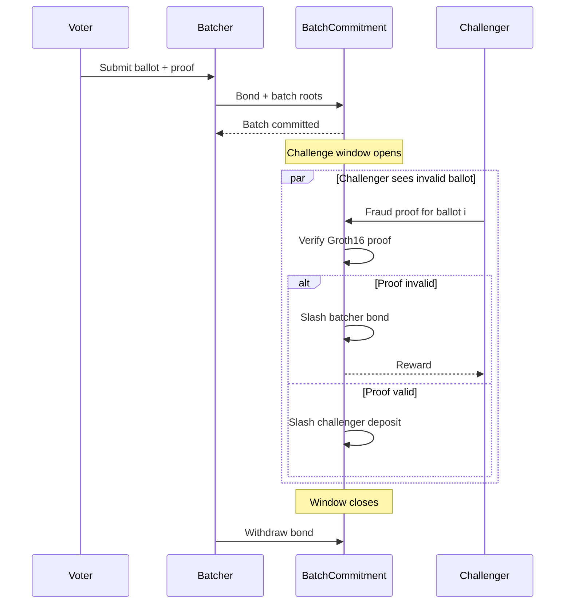

# Future Work

## 1. Fraud-Proof / Challenge-Window Batching

### Problem

`BatchCommitment` records roots but does not prove every ballot is valid. The
batcher is trusted. A recursive validity proof could eliminate this trust, but
implementing a recursive SNARK is a large cryptographic engineering effort.

### Proposed approach

Extend the existing `BatcherReceiptRegistry` omission-claim pattern with a
bonded challenge window:

1. **Batcher posts a bond** before submitting a batch. Released after the
   challenge window expires without a successful challenge.
2. **Time-boxed challenge window** opens after batch commitment.
3. **Fraud proof** — anyone can submit a compact proof that one specific ballot
   is invalid (proof doesn't verify, nullifier reused, or circuit constraints
   unsatisfied). Each fraud proof targets one ballot, not the whole batch.
4. **Bond slashing** — successful challenge slashes the batcher bond; failed
   challenge forfeits the challenger's deposit.

### Sequence diagram



### Why achievable

- Each fraud proof verifies **one** Groth16 proof — no recursive aggregation.
- The verifier contract already exists (`EligibleBallotGroth16Verifier.sol`).
- No new circuit needed; the ballot-validity circuit is already written.
- Economic deterrence replaces cryptographic finality, appropriate for testnet.

---

## 2. Minimal Tally-Consistency SNARK

### Problem

The tally path produces DLEQ-verified decryption shares and aggregates them
locally. `TallyVerifier` has a proof seam but no verifier. A full tally SNARK
would prove all threshold decryption arithmetic inside a circuit, which is
complex.

### Proposed approach

A scoped-down circuit proving: "The decrypted tally `T = [t0, t1, t2, t3]` is
consistent with aggregate ciphertext `C = (C1, C2)` and published partial
decryption shares `D_i` with valid DLEQ proofs."

The circuit would:
1. Accept aggregate ciphertext `(C1, C2)` as public input.
2. Accept each trustee's `D_i` and DLEQ proof as private inputs.
3. Verify each DLEQ proof (BabyJubJub scalar multiplication, not pairing).
4. Combine partial decryptions via Lagrange interpolation.
5. Decrypt by subtracting combined partial decryption from `C2`.
6. Output decrypted counts `T`.

### Why tractable

- DLEQ proofs are **already generated** by `create_trustee_decryption_share.ts`.
- No full DKG proof — only internal consistency of shares vs. aggregate.
- BabyJubJub operations use `EscalarMulFix` already in `eligible_ballot.circom`.
- No pairing needed for DLEQ verification on BabyJubJub.

---

## 3. Pedersen DKG

### Problem

The current threshold ceremony (`create_threshold_ceremony.ts`) uses a trusted
dealer: one party generates all 5-of-9 key shares. This is a demo-only
mechanism. Production needs distributed key generation so no single party ever
knows the full private key.

### Proposed approach

Replace the dealer ceremony with Pedersen DKG among 9 trustees:
1. Each trustee generates a random secret `s_i` and broadcasts commitment
   `g^{s_i}`.
2. Each trustee sends a Shamir share of `s_i` to every other trustee over an
   authenticated channel.
3. Each trustee validates received shares against the commitments.
4. The group public key is the sum of all commitments. Each trustee's final
   secret key is the sum of all received shares.

### Why contained

- **Only touches key generation.** Decryption logic, DLEQ proof format, and
  combiner remain unchanged — the decryption equation is identical regardless
  of key generation method.
- **Shamir + DLEQ infrastructure already exists.** The project already uses
  Shamir secret sharing and DLEQ proofs. Pedersen DKG adds one
  commitment-broadcast round before the existing share-distribution phase.
- **No new on-chain contract.** DKG is entirely off-chain.

---

## 4. Constituency / National Sharding

### Problem

One 24-level Merkle root provides ~16.7M slots. A national deployment needs
more and poses governance questions (who manages the eligibility set?).

### Proposed approach

Per-constituency election instances:

```
Election "India 2029"
  ├─ Constituency "North Delhi"
  │    ├─ ElectionConfig(electionId = hash("India-2029-North-Delhi"))
  │    ├─ EligibilityRootRegistry(electionId = ...)
  │    ├─ EligibleVotingContract(electionId = ...)
  │    └─ BatchCommitment(electionId = ...)
  └─ Constituency "South Mumbai"
       └─ ...
```

### What changes

- **EligibilityRootRegistry** — No change; each constituency deploys its own.
- **Voter proof** — Constituency ID bound into `electionId` in the proof
  signal and nullifier domain (already supported).
- **Tally aggregation** — National result summed from per-constituency tallies.
- **24-level ceiling** — Applies per constituency. If a single constituency
  exceeds 16.7M, increase tree depth (e.g., 28 levels for ~268M slots),
  requiring a new circuit compilation.

Contracts already parametrize `electionId` everywhere. Deployment can iterate
over a constituency list.

---

## 5. Formal Verification and Fuzzing

This project uses Slither for static analysis (see `docs/security-analysis.md`).
Three timestamp-related findings were found, all by-design, no high-severity
issues.

### Recommended follow-on

**Formal verification (Certora)** for invariants:
- Nullifier-root monotonicity in `BatchCommitment`.
- Eligibility root freeze-once in `EligibilityRootRegistry`.
- One-ballot-per-nullifier enforcement.

**Property-based fuzzing (Echidna)** for edge cases:
- Merkle inclusion proofs with arbitrarily long sibling paths.
- `batchCount` and `uint64` timestamp boundary conditions.
- Key collision and zero-address rejection in `VoterRegistry`.

These are left for future work due to specialized toolchain requirements that
are better suited to a dedicated security phase.

